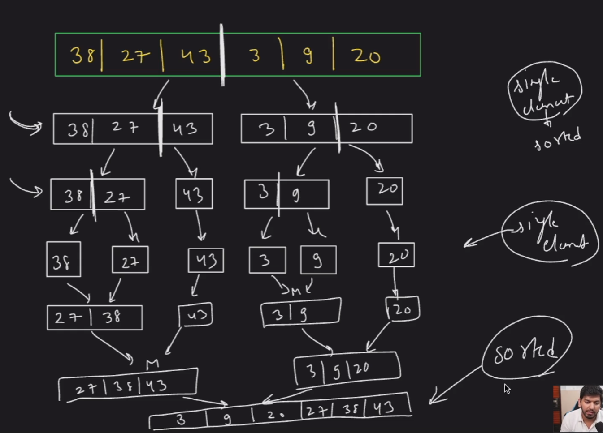

### Marge Sort

## Time Complexity

### Merge Sort Algorithm

1. **Divide Step:** Each time, the array is divided into two halves. This step takes constant time, i.e., \(O(1)\).
2. **Recurrence Relation:**
   - For an array of size \(n\), the recurrence relation can be expressed as:
     \[
     T(n) = 2T\left(\frac{n}{2}\right) + O(n)
     \]
     Here, \(T(n/2)\) is the time to sort each half, and \(O(n)\) is the time to merge the two halves.
3. **Solving the Recurrence Relation:**
   - Using the Master Theorem for divide-and-conquer recurrences, we can determine the time complexity.
   - According to the Master Theorem, for \(T(n) = aT(n/b) + f(n)\):
     \[
     T(n) = 2T\left(\frac{n}{2}\right) + O(n)
     \]
     - Here, \(a = 2\), \(b = 2\), and \(f(n) = O(n)\).
     - Comparing \(f(n)\) with \(n^{\log_b{a}}\):
       - \(n^{\log_2{2}} = n^1 = n\)
     - Since \(f(n) = O(n)\) is equal to \(n^{\log_b{a}}\), the time complexity is:
       \[
       T(n) = O(n \log n)
       \]

Thus, the time complexity of the merge sort algorithm is:
- **Best Case:** \(O(n \log n)\)
- **Average Case:** \(O(n \log n)\)
- **Worst Case:** \(O(n \log n)\)

## Space Complexity

1. **Auxiliary Space:**
   - The merge sort algorithm uses additional space for the temporary arrays `left` and `right` during the merge process.
   - For each merge operation, we allocate space for two temporary arrays with sizes \(len1\) and \(len2\), where \(len1 + len2 = n\).
   - Hence, the space complexity for each merge operation is \(O(n)\).

2. **Recursive Call Stack:**
   - The depth of the recursion tree for merge sort is \(\log n\).
   - Each recursive call uses constant space \(O(1)\).

Combining these two factors, the total space complexity is:
- **Space Complexity:** \(O(n)\)

